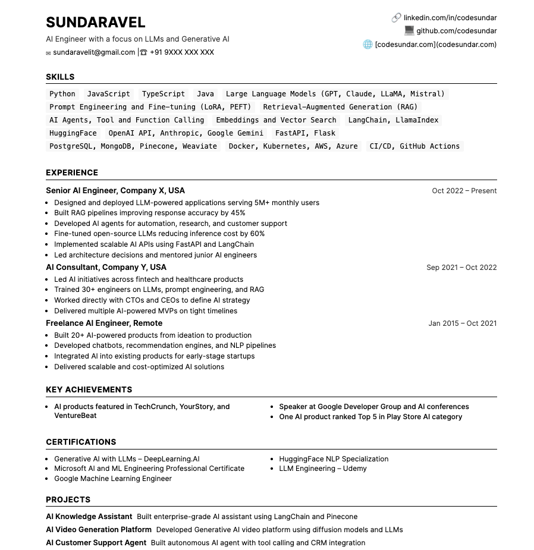

# Resume Builder

A Node.js script that generates customized resumes based on user profiles and job descriptions using OpenAI.

## Video Demo

[](https://youtu.be/e1_f2pBzZK0)

## Screenshot



## Features

- Parses user profile data from a text file
- Analyzes job descriptions to identify key requirements
- Uses OpenAI to tailor resume content to match job requirements
- Generates a professionally formatted HTML resume

## Prerequisites

- Node.js (v14 or higher)
- OpenAI API key (required for the script to work)

> **IMPORTANT**: You must have a valid OpenAI API key to use this tool. If you don't have one, you can get it from [OpenAI's website](https://platform.openai.com/api-keys).

## Installation

1. Clone this repository or download the files
2. Install dependencies:

```bash
npm install
```

3. Set up your OpenAI API key in the `.env` file:

```
OPENAI_API_KEY=your_openai_api_key_here
```

## Usage

1. Update the `user-profile.txt` file with your personal information
2. Add the job description to `job-description.txt`
3. Run the script using either of these commands:

```bash
npm start
```

Or directly with Node.js:

```bash
node resume-maker.js
```

4. The generated resume will be saved as `generated-resume.html`
5. Open the HTML file in a browser to view and print your customized resume

## File Structure

- `user-profile.txt` - Your personal information and experience
- `job-description.txt` - The job description you're applying for
- `resume-template.html` - HTML template for the resume
- `resume-maker.js` - Main script that generates the resume
- `.env` - Environment variables (OpenAI API key)
- `generated-resume.html` - Output file (generated after running the script)

## Customization

You can modify the `resume-template.html` file to change the styling and layout of your resume.

## License

MIT
